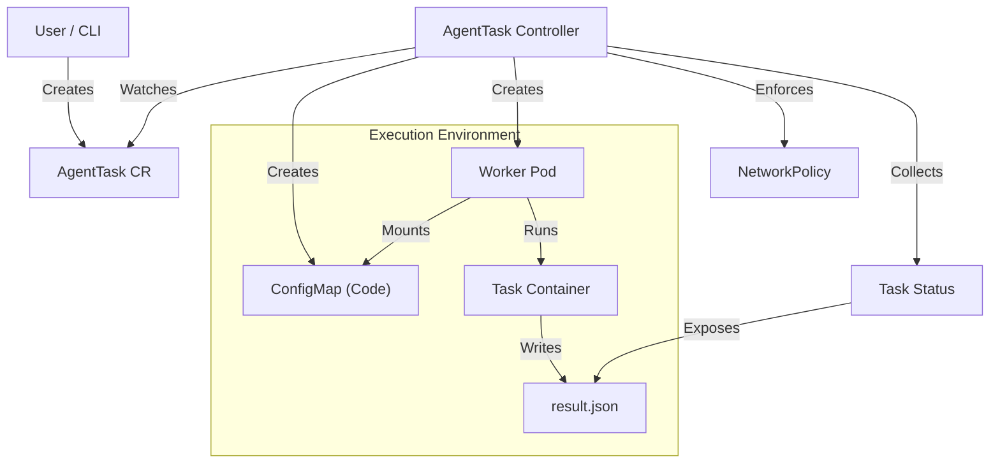

<<<<<<< HEAD
# AgentTask: Production-Grade AI Agent Runtime for Kubernetes
=======
# AgentTask: Production K8s Sandbox for AI Agents

**Production-Grade AI Agent Execution on Kubernetes**
>>>>>>> 467a1c8b733513ce7ae517f00dcf32a4d1daf3ea


The **AgentTask Operator** provides a robust, secure, and K8s-native abstraction for running ephemeral AI agents and code snippets. It bridges the gap between raw Pods and high-level agent frameworks, offering built-in lifecycle management, result capture, and security hardening.

## 🚀 Key Features

- **Secure Isolation**:
  - **Rootless Execution**: Tasks run as UID 1000 by default.
  - **Network Sandbox**: Default-deny NetworkPolicies block unauthorized traffic.
  - **Runtime Profiles**: Whitelist specific images and capabilities (e.g., `python3.11`, `node18`).
- **Lifecycle Management**:
  - **TTL Cleanup**: Automatically delete finished tasks after a configurable duration (`ttlSecondsAfterFinished`).
  - **Finalizers**: Ensure external resources (Pods, Sandboxes) are strictly cleaned up before API objects are removed.
  - **Timeouts & Cancellation**: strictly enforce execution limits.
- **Observability**:
  - **Standardized Failures**: Explicit reasons for failure (`ImagePullFailed`, `Timeout`, `PodFailed`) in the status.
  - **Prometheus Metrics**: Built-in metrics for task counts and duration (`agenttask_total_tasks`, `agenttask_duration_seconds`).
  - **Structured Results**: Automatically captures `result.json` from the task execution.
- **Developer Experience**:
  - **`agentctl` CLI**: A specialized tool to run, inspect, and debug agents without writing YAML.

## 🏗️ Architecture



## 📦 Installation

### Prerequisites

- Kubernetes v1.25+
- `kubectl` configured
- `cert-manager` (for Webhook validation)

### Deploy

```bash
# 1. Install cert-manager
kubectl apply -f https://github.com/cert-manager/cert-manager/releases/download/v1.16.0/cert-manager.yaml

# 2. Deploy Operator
make deploy IMG=ghcr.io/agenttask/controller:latest
```

## 🛠️ Usage (CLI)

The `agentctl` CLI is the recommended way to interact with the operator.

### 1. Build CLI

```bash
cd cmd/agentctl
go build -o ../../agentctl main.go
cd ../..
```

### 2. Run an Agent

Create a script `agent.py`:

```python
import json
print("Generating insight...")
print("INSIGHT: {'value': 42}") # Standard output log
# Write structured result
with open("/workspace/artifacts/result.json", "w") as f:
    json.dump({"status": "success", "insight": 42}, f)
```

Run it:

```bash
./agentctl run agent.py --profile python3.11 --timeout 60
```

### 3. Inspect Execution

```bash
# List tasks with standardized reasons
./agentctl list
# Output:
# NAME                 PHASE       REASON      AGE   POD
# agent-sample-x8dj2   Succeeded               12s   agent-sample-x8dj2-pod
# agent-fail-9k2ls     Failed      Timeout     5m    agent-fail-9k2ls-pod

# Get detailed info & results
./agentctl describe agent-sample-x8dj2
```

## 📝 Usage (YAML)

For GitOps workflows, use the CRD directly:

```yaml
apiVersion: execution.agenttask.io/v1alpha1
kind: AgentTask
metadata:
  name: periodic-agent
spec:
  runtimeProfile: "python3.11"
  timeoutSeconds: 300
  ttlSecondsAfterFinished: 600 # Delete 10m after finish
  code:
    source: |
      import os
      print(f"Running secure task in K8s!")
  resources:
    limits:
      cpu: "1"
      memory: "512Mi"
```

## 🔍 Troubleshooting

| Issue             | Cause                                                                    | Fix                                                           |
| :---------------- | :----------------------------------------------------------------------- | :------------------------------------------------------------ |
| `ImagePullFailed` | The RuntimeProfile maps to an invalid image or registry auth is missing. | Check controller logs and `runtimeProfile` config.            |
| `Timeout`         | Task took longer than `timeoutSeconds`.                                  | Optimize code or increase timeout in Spec.                    |
| `Webhook Denied`  | The request violated security policies (e.g. invalid profile).           | Check `kubectl describe` events or admission controller logs. |

## 🤝 Contributing

See [Development Guide](docs/setup_guide.md) for local setup instructions.

## 📄 License

Apache 2.0
